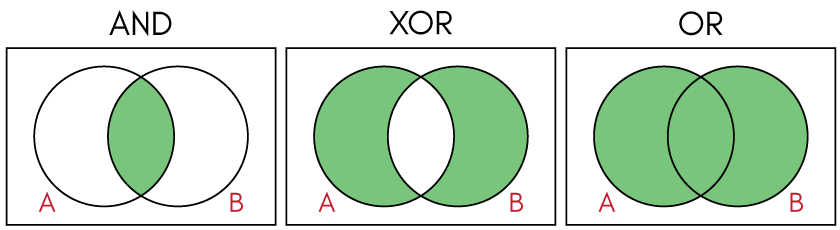

This article was first published at [Medium](https://towardsdatascience.com/a-comprehensive-tutorial-to-rust-operators-for-beginners-11554b2c64d4)

# XOR and Bitwise Operators Truth Table

As we saw previously, Python and Rust use the same symbols for bitwise symbols `AND`, `OR` , and `XOR`.

`&` is the bitwise `AND`, `|` is the bitwise `OR` , and `^` is the bitwise XOR (exclusive OR). You can see the truth table and the Venn diagram below.


| a   | b   | AND: a & b | OR: a \| b | XOR: a ^ b |
| --- | --- | ---------- | ---------- | ---------- |
| T   | T   | 1          | 1          | 0          |
| T   | F   | 0          | 1          | 1          |
| F   | T   | 1          | 1          | 1          |
| F   | F   | 0          | 0          | 0          |



When you use `XOR` with even numbers of the same number, the output is always 0.

In Rust, you can use `{:#b}` to print [binary](https://doc.rust-lang.org/std/fmt/trait.Binary.html).

```rust runnable
fn main() {
    // xor with even numbers of the same number output 0
    println!("0 ^ 0 = {}", 0 ^ 0);
    println!("Binary: 0 ^ 0 = {:#b}", 0 ^ 0);
    println!("1 ^ 1 = {}", 1 ^ 1);
    println!("Binary: 1 ^ 1 = {:#b}", 1 ^ 1);
    println!("2 ^ 2 = {}", 2 ^ 2);
    println!("Binary: 2 ^ 2 = {:#b}", 2 ^ 2);
    println!("3 ^ 5 ^ 3 ^ 5 = {}", 3 ^ 5 ^ 3 ^ 5);
    println!("Binary: 3 ^ 5 ^ 3 ^ 5 = {:#b}", 3 ^ 5 ^ 3 ^ 5);
    // xor with odd numbers of the same number won't output 0 
    println!("1 ^ 1 ^ 1 = {}", 1 ^ 1 ^ 1);
    println!("Binary: 1 ^ 1 ^ 1 = {:#b}", 1 ^ 1 ^ 1);
    println!("1 ^ 1 ^ 5 = {}", 1 ^ 1 ^ 5);
    println!("Binary: 1 ^ 1 ^ 5 = {:#b}", 1 ^ 1 ^ 5);
}
```

In Python

```python runnable
# output 0
print(0 ^ 0)
print(bin(0 ^ 0))

print(1 ^ 1)
print(bin(1 ^ 1))

print(2 ^ 2)
print(bin(2 ^ 2))

# output non 0
print(1 ^ 1 ^ 1)
print(bin(1 ^ 1 ^ 1))
```

